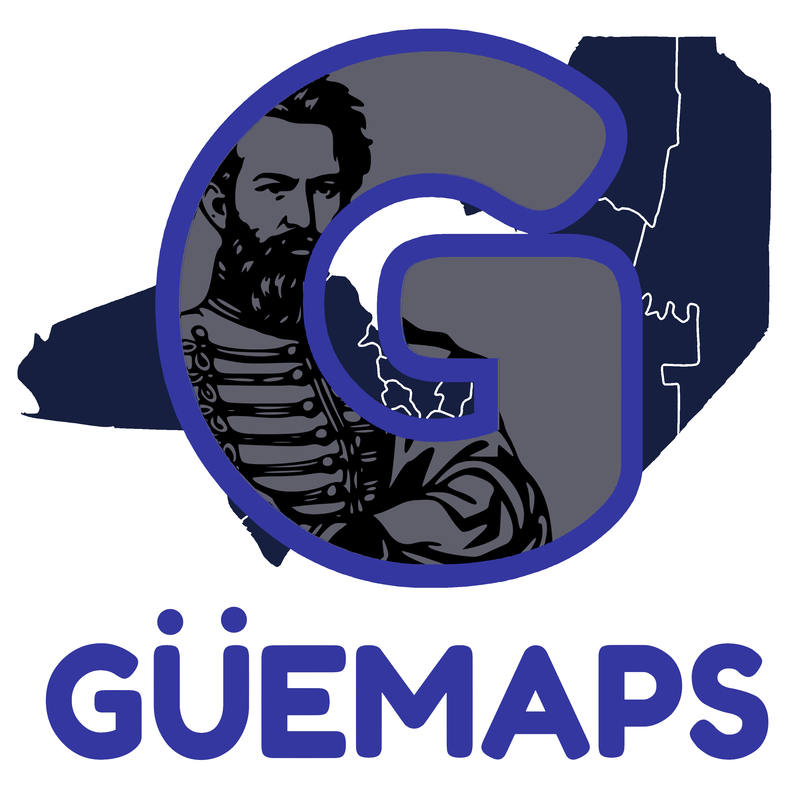

# Güemaps

  

Güemaps es una aplicación orientada a la visualización de líneas de transporte urbane e interurbano
en Salta que busca brindar una mejor experiencia de usuario que las alternativas oficiales.

Con esta aplicación, puedes:

- Ver las posiciones de múltiples colectivos en Salta Capital.
- Encontrar puntos de venta para recargar tu tarjeta de transporte.
- Consultar el saldo de tu tarjeta de transporte.
- Ver las últimas noticias del servicio de transporte público.

## Instalación
Descarga la última versión desde la página de [Releases](https://github.com/nesktf/guemaps/releases)

Instalación desde la Google Play store próximamente! (cuando Google apruebe la app)

## Contribuciones
Güemaps es software libre, recibimos cualquier tipo de contribuciones siempre y cuando te apegues
a los siguientes puntos:

- Si deseas contribuir código, haz una pull requests en este repositorio.
- Si quieres informar bugs o realizar recomendaciones, abre una issue en este repositorio.
- El código que contribuyas debe estar licenciado bajo GNU GPLv3.
- Las contribuciones hechas con LLMs estan permitidas, siempre y cuando **las entiendas
completamente y puedas explicar lo que haz hecho al realizar la pull request**.
- Si no sabes programar, también recibimos colaboraciones para traducir la aplicación a otros idiomas!

## Creditos
- Mapas: OpenStreetMap (OSM) y OpenStreetMap contributors
- Biblioteca de mapas: osmdroid
- Fuente de los datos: SAETA / MiRedBus
- Artista del ícono de la aplicación: [luxxyarts](https://www.instagram.com/luxxyxarts)

## Donaciones
Si encontraste útil esta aplicación y quieres colaborar conmigo, puedes invitarme un café! El
dinero será reinvertido en mantener la aplicación y brindar mas funciones a los usuarios.

